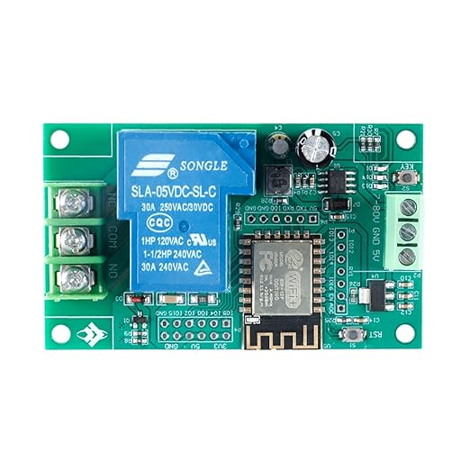

# 7-80V ESP12F Relay Board

Example files and notes 

This board is currently available from Amazon, Aliexpress, etc. and combines an ESP-12F with a 30 amp SPDT relay.  No documentation is provided with the board and there is little or no information online about it as of the time of this writing.

This repository contains some examples from the Arduino environment that I used to figure out the basic board configuration and illustrate its use.

## Board information:
* Arduino programming should be done with the generic ESP8266 board type
* **Key** button is on GPIO0 and is active low.  Holding this button down during reset puts the board in program upload mode.
* The relay can be jumpered to GPIO's 12, 13, 14 or 16 and is **active high**.  The easiest to use is GPIO16 or GPIO14.
* The **activity LED** labeled "D14" is on GPIO5 and is active low.
* **LED_BUILTIN** is GPIO2 and is active low.  Use with caution as there is activity on this pin during program uploading.
* The useable I/O pins are GPIO's 0,2,4,5,12,13,14,15,16.  Do note however that GPIO0 is also bootload enable (if held low during reset) and GPIO2 tracks TxD during program uploading.

This repository will be updated as more information is discovered about this board.
